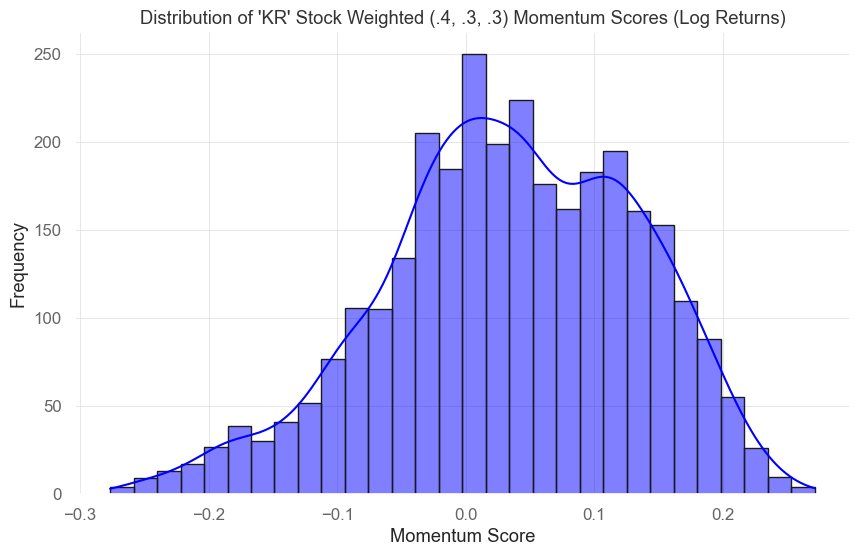
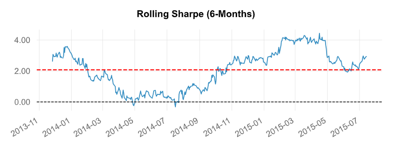
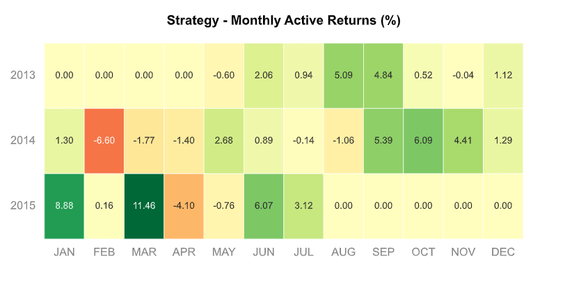
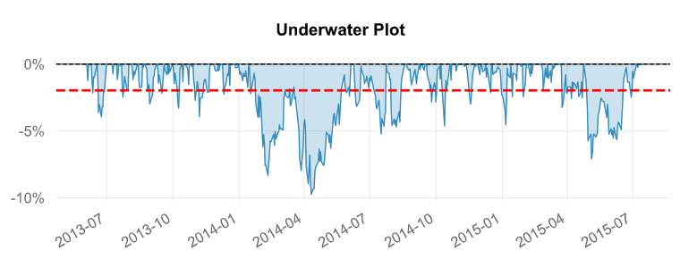

# Understanding the Stock Selection Strategy

The stock selection strategy implemented in this project is focused on utilizing a combination of low volatility and high momentum to identify potential stocks within the S&P 500 index. Let's delve into the background and rationale behind this approach.

## Context and Background

The financial markets, especially stock markets, are known for their volatility, making it challenging to predict future stock movements accurately. This strategy aims to mitigate this challenge by incorporating both low volatility and high momentum metrics, which historically have shown promising indicators of potential stock performance.

## Creation and Purpose

The motivation behind creating this strategy was to develop a reliable and systematic method for identifying stocks that exhibit steady upward momentum while maintaining lower volatility. This was intended to assist investors and traders in making informed decisions when selecting stocks for their portfolios, aiming to improve the chances of achieving favorable returns.

## Examples and Approaches

### Incorporating Volatility and Momentum

The strategy involves a multi-step process that includes:

- Calculating volatility using rolling standard deviations.
- Assessing momentum over varying periods (1-month, 3-month, and 6-month).

- Combining these metrics to select the top 10 stocks that meet specific criteria for both low volatility and high momentum.

### LSTM Neural Network Implementation

The strategy employs an LSTM neural network to predict stock values based on historical data. This neural network utilizes past stock performance to anticipate potential future movements, aiding in the stock selection process, besides using an exogenous variables approach - that is, each selected stock is assumed to be of influence to the other ones, when training the models.

## Making Connections

By integrating both low volatility and high momentum, this strategy aims to strike a balance between risk and potential return. It aims to identify stocks that exhibit strong upward trends while minimizing exposure to abrupt fluctuations.

## Primary Results

In the forward backtesting made from 2013 to 2015, the primary rolling Sharpe ratio settled with a mean value of 2 - an average seen by overall investors as of good quality.

The monthly active returns were found to be mainly positive, with overperforming months being January and March:

In return quantiles, those would be seen as more favorable in yearly time divisions, as we can see below:

---

Lastly, to give potential users an idea of mean losses per quarter period during the backtest, the following underwater plot gives out a mean negative returns close to 2%:

## Next Steps

As to future endeavors in this project, we may include a longer-period backtesting to better visualize the model's performance. We may also include loss-stop steps, as to try to minimize certain months' losses by including advance orders to sell stocks beforehand.