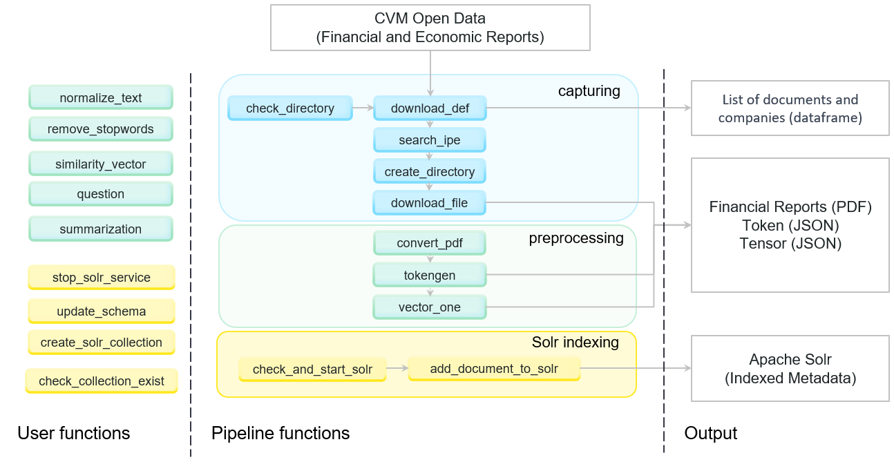

# Bem-vindo ao FICO

On this page, we will present the documentation for the Pipeline package designed for metadata capture, preprocessing, and indexing.

This project is part of the multidisciplinary Computational Finance and Systematic Investments interest group, operating within the Instituto Tecnológico de Aeronáutica  ([FICO-ITA](https://fico-ita.github.io/fico/)).

## Organização da documentação

A organização desta documentação de usuário consiste nas classes de documentos:

1. Tutorial
1. Reference
1. Explanation


The above documentations are crafted for the solution's user-reader. The target audience consists of the solution's developers and architects.

In this documentation, the emphasis is on the proposed pipeline structure and solution organization, showcasing a solution's component diagram and illustrating their interactions.

## Pipeline CPI - FICO

::: fico

### Arquitetura proposta:

<figure>
  
  <figcaption>Software Architecture PyCPI</figcaption>
</figure>

Etapas

* `1`  Conecta ao portal de dados abertos CVM
* `2`  Faz o download da lsita de documentos, contendo nome da empresa, tipo de documento, link para download.
* `3` Cria a estrutura caso necessário, faz o download do relatorio economico financeiro armazenando o em pdf
* `4` Converte o pdf para texto
* `5` Gera tokens e tensores do respectivo documento, armazenando localmente no mesmo diretorio do relatório pré-processado
* `6` Gera o json contendo todos os metadados da etapa de captura e préprocessamento
* `7`  Inicializa o serviço solr (caso não esteja ativo), indexa os metadados


## Artigo

[Pipeline de disponibilização dos Relatórios Obrigatórios no mercado de Capitais Brasileiro](PyCPI_package.pdf)

## Licença

[Apache License 2.0](LICENSE)

## Citação

### APA
```text
C. N da Silva, T. Pipeline de disponibilização dos Relatórios Obrigatórios no mercado de Capitais Brasileiro [Computer software]. https://github.com/fico-ita/po_245_2023_T4.git
```

### BibTeX
```bibtex
@software{C_N_da_Silva_Pipeline_de_disponibilizacao,
author = {C. N da Silva, Thiago},
title = {{Pipeline de disponibilização dos Relatórios Obrigatórios no mercado de Capitais Brasileiro}},
url = {https://github.com/fico-ita/po_245_2023_T4.git}
}
```