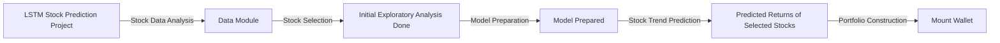

# Welcome!

## Project Documentation Breakdown

1. [Tutorial](./tutorials.md): Practical guide for new users, explaining code usage and essential steps for stock selection strategy.

2. [How-to Guide](./how-to-guides.md): Documentation focused on problem-solving approaches, assisting users in resolving common tasks using the code.

3. [Reference](./reference.md): Detailed documentation of functions, modules, and methods provided in the code.

4. [Explanation](./explanation.md): Explains internal workings, rationale behind choices, and concepts used in the stock selection strategy.

### Decision-making and Solution Organization

We highlight key decisions made during the solution implementation:

- Use of an LSTM neural network to predict selected stocks' trends using an exogenous variables approach.
- Modular organization of the code for ease of maintenance and reusability.
- Stock selection strategy based on volatility and momentum analysis.

### Component Diagram - Diagram Visualization Bug

The component diagram below illustrates the structure of the proposed strategy:


This diagram showcases how modules interact within the LSTM strategy, from data analysis to portfolio construction.

## Project

Selects 10 stocks based on a low volatility and high momentum trading strategy, and predicts 1-day ahead return values, building a corresponding portfolio based on such. Exported modules for this package:

- `lstm_strategy`: Mount portfolio
- `get_retornos_sp`: Retrieve the returns of SP&500 stocks
- `load_data`: Load all stock historical data provided
- `strategy_simulator`: Simulates the selected strategy

# Licenses

- Data provider: [Stock Market, Funds, Fixed Income and Asset Consolidation Data Analysis](https://www.comdinheiro.com.br/)
- Supporting group: [FICO](https://fico-ita.github.io/)
- Code License: [Apache 2.0](https://www.apache.org/licenses/LICENSE-2.0)

## Acknowledgements

- We thank the support of the **comdinheiro** platform in providing all the useful historical stock data used in this project, and also
- We thank the intelectual and practical support provided by all existing personas within the **FICO** group.

## How to cite

Include in your project citations the following:
```python
authors:
- family-names: "Bustos"
  given-names: "Victor"
  LinkedIn: "https://www.linkedin.com/in/victoropb/"
- family-names: "Nunes"
  given-names: "Marcus"
  LinkedIn: "https://www.linkedin.com/in/marcusganunes/"
title: "Low Volatility and High Momentum Investment Strategy"
version: 1.0
url: "https://github.com/fico-ita/po_245_2023_S2_T4/tree/main"
```
